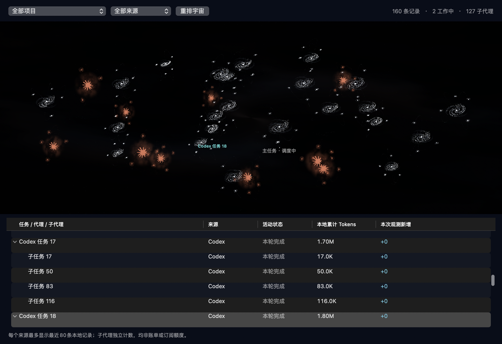

# Token Galaxy

A small native macOS orb that turns local AI work into a living star field.

**Codex + Claude Code · Swift + Metal · local data · no API key**

[中文说明](README.zh-CN.md) · [Data & privacy](docs/DATA.md) · [Related projects](docs/RELATED_PROJECTS.md)


*Native rendering with synthetic demo sessions, not personal usage.*

## What it does

- Shows Codex and Claude Code sessions, main tasks and subagents in a floating orb and a filterable task overview.
- Shows one slowly drifting universe in the large overview, with naturally scattered larger nebulae for main tasks and their own child tasks around them. All currently read records are shown. Selection and refresh keep the arrangement stable; “重排宇宙” reshuffles it smoothly. Names appear for selected, working or hovered families. The small floating orb stays compact.
- Animates newly observed token activity; historical totals do not replay as fresh work.
- Keeps source totals separate and displays only discovered sources. Claude appearance controls are hidden when there are no Claude records.
- Includes a companion spirit, adjustable orb size/opacity, and independent Claude symbol sizing.
- Offers a flowing Touch Bar on supported Macs. Hardware without a Touch Bar has no Touch Bar menu item.
- Follows the fastest active main conversation after one minute without interaction. Manual interaction takes priority.

The current application interface is Chinese. English localization is a future improvement.



## Requirements

macOS 15 or later, Metal-capable graphics, and Apple Command Line Tools for source builds (`xcode-select --install`). No package manager dependencies. Local sessions from Codex, Claude Code, or both supply the data; having both tools installed is optional.

Intel runtime is tested. Apple Silicon builds are cross-compiled but need native runtime validation.

## Install as a Codex plugin

With a Codex CLI version that supports plugins:

```sh
codex plugin marketplace add ssg87/token-galaxy
codex plugin add token-galaxy@token-galaxy
```

Then ask Codex: **“Open Token Galaxy.”** The bundled skill builds the application on first launch and opens it. Plugin updates may require a fresh first build. Existing display preferences remain in macOS preferences.

The repository includes its marketplace at `.agents/plugins/marketplace.json`. See [OpenAI plugin documentation](https://developers.openai.com/plugins/build/plugins).

## Run as a standalone app

The [Releases page](https://github.com/ssg87/token-galaxy/releases) currently provides the 0.7.0 universal app. The newer family overview described here is available through a source build or the Codex plugin. It contains Intel and Apple Silicon binaries; it is ad-hoc signed and not notarized. Source builds remain available below.

```sh
git clone https://github.com/ssg87/token-galaxy.git
cd token-galaxy
./build.sh
open 'plugins/token-galaxy/Outputs/Token Galaxy.app'
```

You can copy the resulting app into Applications. Source builds use an ad-hoc signature, not an Apple Developer ID signature or notarization. The app is independent of the Codex plugin after building.

## Using the orb

Click a conversation to inspect its local count. Right-click the orb or use the sparkles menu for the task overview, appearance controls, pause, visibility, and quit. Orb size is 96–640 points; Claude symbol scale is 80–160%. The Touch Bar appears through standard AppKit support and may need the menu's activation action.

Only locally observed activity drives new-token motion. The app cannot tell you remaining plan quota, reset time, or billable spend. See [the exact data scope](docs/DATA.md).

## Development and checks

```sh
./build.sh
'plugins/token-galaxy/Outputs/Token Galaxy.app/Contents/MacOS/TokenGalaxy' --self-test
python3 plugins/token-galaxy/Tests/availability_probe.py
python3 plugins/token-galaxy/Tests/dual_source_probe.py
python3 plugins/token-galaxy/Tests/integration_probe.py
python3 plugins/token-galaxy/Tests/menu_total_probe.py
python3 plugins/token-galaxy/Tests/idle_focus_probe.py
```

The Python probes require a logged-in macOS desktop and use synthetic temporary session data. Outputs are ignored by Git. `--self-test` is fixture-only and suitable for macOS CI. `--capabilities` prints detected provider names and Touch Bar availability without session titles.

See [contributing](CONTRIBUTING.md) for UI validation and [security reporting](SECURITY.md) for private-data handling.

## License and attribution

Project code is MIT-licensed. Third-party names, marks, and the reference-derived Claude shape remain subject to their owners' rights; the code license grants no trademark or third-party artwork rights. See [NOTICE](NOTICE). This is an independent community project, not affiliated with OpenAI or Anthropic.
