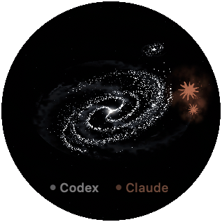

# Token Galaxy · Token 星簇

一个把本地 AI 工作变成流动星河的原生 Mac 悬浮球。

支持 **Codex 和 Claude Code**，用 Swift、AppKit 和 Metal 实现，直接读取本机已有会话，无需 API Key。

[English](README.md) · [数据口径与隐私](docs/DATA.md) · [同类项目参考](docs/RELATED_PROJECTS.md)



演示使用合成会话，不包含个人使用记录。

## 能看到什么

- 本地主对话、代理和子代理，以及它们的累计 token 和观测新增。
- 新增 token 驱动星河变化，打开应用时不会把历史量伪装成正在生成。
- Codex 和 Claude 分来源显示；未发现 Claude 会话时隐藏 Claude 图标设置。
- 星灵陪伴、球体大小和透明度设置，Claude 图标可独立调整大小。
- 有 Touch Bar 的 Mac 可显示流动星河；没有 Touch Bar 时隐藏相关入口。
- 闲置一分钟后自动跟随活动最快的主对话，手动操作优先。

显示的是本地记录中的用量，**不是套餐剩余额度、账户总额度或账单金额**。主窗口每个来源最多显示最近 80 条记录，菜单合计范围更大，详见数据说明。

## 环境

macOS 15 或更新版本，支持 Metal。源码首次编译需要 Apple 命令行工具，可运行 `xcode-select --install` 安装。没有额外包管理器依赖，不需要同时安装 Codex 和 Claude Code。

已在 Intel Mac 上运行验证。Apple Silicon 提供交叉编译检查，尚需原生机器运行验证。当前应用界面为中文。

## 安装到 Codex

在支持插件的 Codex CLI 中执行：

```sh
codex plugin marketplace add ssg87/token-galaxy
codex plugin add token-galaxy@token-galaxy
```

然后对 Codex 说：**“打开 Token Galaxy。”** 首次会从插件附带源码编译，可能需要几分钟；之后直接打开。

## 作为独立 Mac 应用运行

```sh
git clone https://github.com/ssg87/token-galaxy.git
cd token-galaxy
./build.sh
open 'plugins/token-galaxy/Outputs/Token Galaxy.app'
```

编译后可将应用复制到“应用程序”。构建使用本地临时签名，尚未进行 Apple Developer ID 签名和公证。

右键圆球或点击菜单栏星光图标，可查看任务总览、调整外观、暂停、隐藏和退出。球体大小支持 96–640，Claude 图标比例支持 80–160%。

## 隐私与限制

应用只读本机会话，不上传数据、不连接模型 API、不要求登录。读取范围和日志格式兼容性见 [DATA.md](docs/DATA.md)。没有本地会话时显示空状态；会话后续出现时自动发现。

## 参与与许可

欢迎提供隐去个人信息的错误描述、合成测试和改进。不要在 Issue 中上传真实会话日志、密钥或本地数据库。

代码采用 MIT 许可。Claude 等名称、标识及参考图形的权利属于相应权利人，不因代码开源而授予品牌或第三方图形使用权。详见 [NOTICE](NOTICE)。本项目与 OpenAI、Anthropic 无隶属或官方合作关系。
